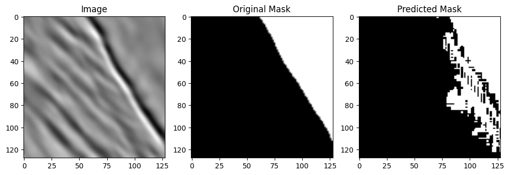
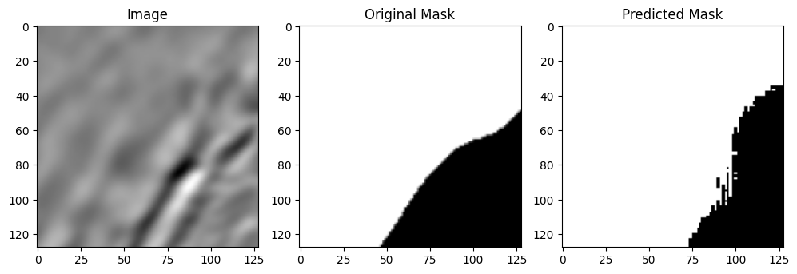
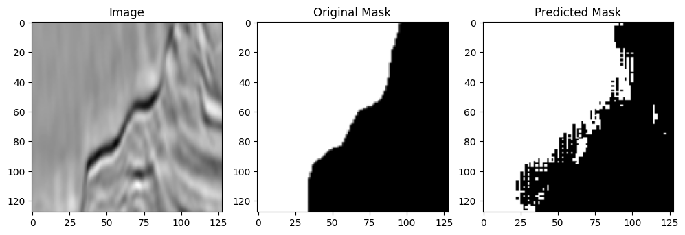

# Salt-Segmentation-UNet
Implement a salt segmentation using `UNet` with `PyTorch` for [TGS Salt Identification Challenge](https://www.kaggle.com/c/tgs-salt-identification-challenge)

## U-Net Architecture Overview
The U-Net architecture follows an encoder-decoder cascade structure, where the encoder gradually compresses information into a lower-dimensional representation. Then the decoder decodes this information back to the original image dimension. Owing to this, the architecture gets an overall U-shape, which leads to the name U-Net.


## Dataset overview
For this task I use the TGS Salt Segmentation dataset. The dataset was introduced as part of the [TGS Salt Identification Challenge](https://www.kaggle.com/c/tgs-salt-identification-challenge) on Kaggle.

Practically, it is difficult to accurately identify the location of salt deposits from images even with the help of human experts. Therefore, the challenge required participants to help experts precisely identify the locations of salt deposits from seismic images of the earth sub-surface. This is practically important since incorrect estimates of salt presence can lead companies to set up drillers at the wrong locations for mining, leading to a waste of time and resources.

I use a sub-part of this dataset which comprises 4000 images of size 101×101 pixels, taken from various locations on earth. Here, each pixel corresponds to either salt deposit or sediment. In addition to images, we are also provided with the ground-truth pixel-level segmentation masks of the same dimension as the image

## How to install
```bash
git clone https://github.com/matin-ghorbani/Salt-Segmentation-UNet.git
cd Salt-Segmentation-UNet/
pip install -r requirements.txt
```

## How to run the predict.py
### Run this command
```bash
python3 predict.py --img YOUR_IMG.JPG
```
#### You can also see the other arguments of it with this command
```bash
python3 predict.py --help
```
*For Example:*
- *`--model`*: The model file path **default:***`UNet_tgs_salt.pth`*
- *`--show, --no-show`*: You can show the predicted mask **default:***`True`*
- *`--save, --no-save`*: You can save the predicted mask **default:***`True`*

## Results

---

---

---

---
*you can download the weight of it from [here](https://drive.google.com/file/d/1-0lm6r81HdIGToCgKsrXttTjn2krL3mX/view?usp=sharing) if you want to.*